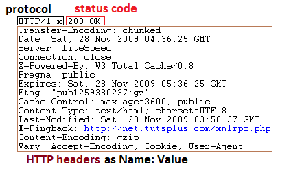

# HTTP Headers

```php
getallheaders()
// gets the request headers. You can also use the $_SERVER array.

headers_list()
// gets the response headers
```

## Diagram of HTTP Request Structure


- First line consists of three parts
  - `method` type of request
    - `GET` retrieves a document
    - `POST` send data to server
    - `HEAD` retrieve header information - "when you send a HEAD request, it means that you are only interested in the response code and the HTTP headers, not the document itself" - does not return the content
      - useful for checking for broken links
  - `path` part of the URL that comes after the host (domain)
  - `protocol` HTTP and its version
- Following lines contain HTTP headers as "name: value" pairs



- First line: protocol (HTTP) + status code
  - [Types of status codes](https://developer.mozilla.org/en-US/docs/Web/HTTP/Status)
    - **100-199** Informational responses
    - **200-299** Sucessful responses
    - **300-399** Redirects
    - **400-499** Client errors
    - **500-599** Server errors
- Following lines: same as request structure

## Some resources:
- [Headers for Dummies by Tutsplus](https://code.tutsplus.com/tutorials/http-headers-for-dummies--net-8039)